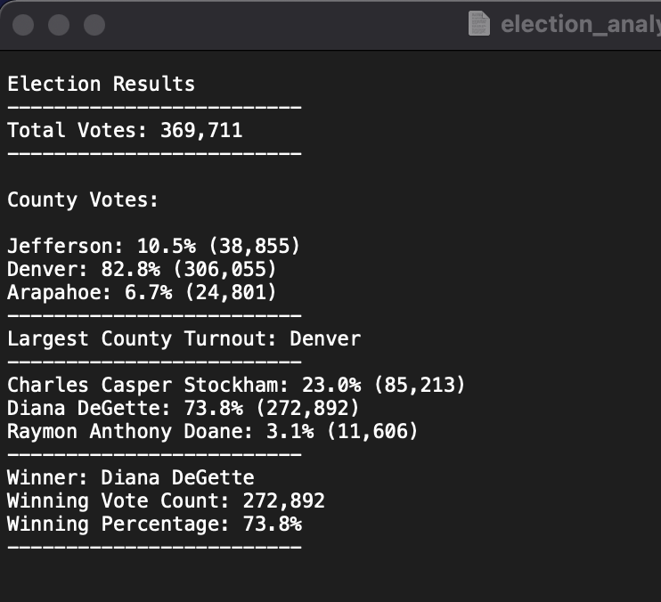

# Election_Analysis

# Project Overview

A Colorado board of elections employee has given you the following tasks to complete the election audit of a recent local congressional election

1. Calculate the total number of votes cast.
2. Get a complete list of candidates who received votes.
3. Calculate the total number of votes each candidate received.
4. Clculate the percentage of votes each candidate won.
5. Determine the winner of the election based on popular vote.

## Resources
- Data Source: election_results.csv
- Software: Python 3.9.12, Visual Studio Code, 1.71.0

## Summary

Election Results
-------------------------
Total Votes: 369,711
-------------------------
- Charles Casper Stockham: 23.0% (85,213) 
- Diana DeGette: 73.8% (272,892)
- Raymon Anthony Doane: 3.1% (11,606)
-------------------------
- Winner: Diana DeGette
- Winning Vote Count: 272,892
- Winning Percentage: 73.8%
-------------------------

The analysis of the election show that:
- There were 369,711 votes cast in the election
- The candidates were:
	- Charles Casper Stockham
	- Diana DeGette
	- Raymon Anthony Doane

- The candiate results were:
	- Charles Casper Stockham received 23% of the vote and 85,213 number of votes
	- Diana DeGette received 73.8% of the vote and 272,892 number of votes
	- Raymon Anthony Doane received 3.1% of the vote and 11,606 number of votes

- The winner of the election was:
	- Diana DeGette who received 73.8% of the vote and 272,892 number of votes

## Challenge Overview

After reviweing the results that were provided by analyzing election results by candidate, the election commission has requested to analyze election results by county. In this analysis, we will:

1. Calculate voter turnout for each county
2. The percentage of votes from each county out of the total count
3. The county with the highest turnout

## Resources

We will use the same resources used in the first part of the analysis.
- Data Source: election_results.csv
- Software: Python 3.9.12, Visual Studio Code, 1.71.0

## Challenge Summary

Denver county recorded the largest turnout, at 82.8% (306, 055) votes. Araphoe county recorded lowest count, at 6.7% (24,801)

Election Results by County
-------------------------

- Charles Casper Stockham: 23.0% (85,213)

- Diana DeGette: 73.8% (272,892)

- Raymon Anthony Doane: 3.1% (11,606)
-------------------------
- Winner: Diana DeGette
- Winning Vote Count: 272,892
- Winning Percentage: 73.8%
-------------------------

### County Votes:

#### Jefferson: 10.5% (38,855)

#### Denver: 82.8% (306,055)

#### Arapahoe: 6.7% (24,801)

-------------------------
#### Largest County Turnout: Denver
-------------------------

## Challenge Summary

This was a very good exercise to learn basics of python coding. I was able to develop design and coding patterns during the lesson and re-use the same principles during the challenge. Using iterative loops such as for and if to calculate votes by candidate and county was fun! I also got a chance to open and read a file and to write output to a file, all from my python script. I liked the way the 'with' statement combines both open and close methods in a single statement. 

Coming to the problem, Here are the observations:

- Denver county recorded the largest turnout, at 82.8% (306, 055) votes. Araphoe county recorded lowest count, at 6.7% (24,801)

- The election was performed in a precinct with 3 counties, Jefferson, Denver and Apharoe. Based on the dataset, the largest voting turnout was recorded in Denver county and the lowest was in Araphoe county.
- 3 Candidates stood in the election and Diana DeGette won the election with 73.8% votes. She got 272,892 votes out of the total 369,711 votes that were cast. 

_Overall, this script can be used for any election analysis where there is data on participating candidates and counties in elections. This script can be modified a bit and can be used for the following scenarios as well:_

- Analyzing percentage voting based on the population of the county. For example, Araphoe county recorded lowest turnout, but the number of people in this county is not known. May be the county has 25k population and most of them cast their vote. Has the committee captured this information of the number of eligible voters, it would have changed the analysis results.
- Another way this script could have been reused is to calculate the % votes for a candidate in each county. This could determine which candidate has the popular vote.

